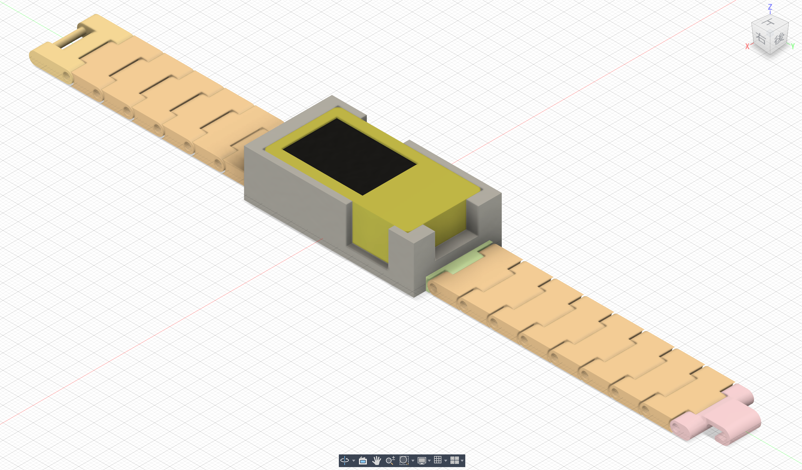

# プログラムの解説 - Water Watch

## GitHubリポジトリ
- https://github.com/Sora339/water-watch

## 使用ライブラリ
- **M5StickCPlus2**: M5StickC PLUS2デバイスの制御用ライブラリ
- **WiFi**: Wi-Fi接続とNTPサーバーとの通信用
- **BLEDevice/BLEUtils/BLEScan/BLEAdvertising**: Bluetooth Low Energy通信用
- **time/sys/time**: 時刻管理とNTP時刻同期用
- **cmath**: 時計の針の座標計算用（三角関数）
- **PIL (Python)**: PNG画像からビットマップデータへの変換用
- **numpy (Python)**: 画像データの配列処理用

## 機能

### 1. 時計機能 ([clock/clock.ino](water-watch/clock/clock.ino))
- **NTP時刻同期**: Wi-Fi経由でNTPサーバー（ntp.nict.jp）から日本標準時（JST）を取得
  ```cpp
  configTime(0, 0, NTP_1, NTP_2);  // clock.ino:126
  now += GMT_OFFSET_SEC + DST_OFFSET_SEC;  // clock.ino:130
  ```
- **アナログ時計表示**: 円形の時計盤に時針、分針、秒針を描画
  ```cpp
  void drawClockFace() {
    StickCP2.Display.fillCircle(40, 40, 40, COLOR_FACE);  // clock.ino:38
    // 時刻マーカーの描画（30度間隔）
    for (int i = 0; i < 360; i += 30) { ... }  // clock.ino:41-49
  }
  ```
- **デジタル時計表示**: 画面下部に「HH:MM:SS」形式で表示
  ```cpp
  StickCP2.Display.printf("%02d:%02d:%02d", t.hours, t.minutes, t.seconds);  // clock.ino:69
  ```

### 2. 歩数計機能 ([pedometer/pedometer.ino](water-watch/pedometer/pedometer.ino))
- **加速度センサーによる歩数検出**: IMUから3軸加速度を取得し、合成加速度で歩数を判定
  ```cpp
  StickCP2.Imu.getAccelData(&accX, &accY, &accZ);  // pedometer.ino:47
  float magnitude = sqrt(accX * accX + accY * accY + accZ * accZ);  // pedometer.ino:50
  if (magnitude > stepThreshold && !isStep && ...) { stepCount++; }  // pedometer.ino:53-56
  ```
- **PNG画像の表示**: Pythonスクリプトで変換したビットマップデータを表示
  ```cpp
  StickCP2.Display.pushImageRotateZoom(..., IMG_DATA[0]);  // pedometer.ino:26-34
  ```
- **リアルタイム歩数表示**: 5桁の歩数カウンターを画面中央に表示

### 3. モールス信号通信機能 ([morse/morse.ino](water-watch/morse/morse.ino))
- **BLE通信**: Bluetooth Low Energyのアドバタイジングでメッセージを送受信
  ```cpp
  #define SERVICE_UUID "4fafc201-1fb5-459e-8fcc-c5c9c331914b"  // morse.ino:8
  pBLEAdvertising->setMinInterval(32);  // 20ms固定間隔で送信 morse.ino:108-109
  ```
- **モールス符号入力**: ボタンの短押し(.)と長押し(-)でモールス符号を入力
  ```cpp
  if (duration < 250) {
    currentSymbol += ".";  // morse.ino:216
  } else {
    currentSymbol += "-";  // morse.ino:219
  }
  ```
- **モールス符号デコード**: タイムアウトベースで文字を確定し、A-Zをデコード
  ```cpp
  char decodeMorse(String morse) {
    if (morse == ".-") return 'A';
    if (morse == "-...") return 'B';
    // ...  // morse.ino:38-66
  }
  ```
- **冗長送信**: メッセージを12秒間繰り返し送信して受信確率を向上
  ```cpp
  const unsigned long SEND_DURATION = 12000;  // morse.ino:34
  ```

### 4. 統合スマートウォッチ ([smartwatch/smartwatch.ino](water-watch/smartwatch/smartwatch.ino))
- **メニュー画面**: ボタンでClock/Pedometer/Morseの3モードを選択
  ```cpp
  enum AppMode { MODE_MENU, MODE_CLOCK, MODE_PEDOMETER, MODE_MORSE };  // smartwatch.ino:16-21
  ```
- **モード切り替え**: ボタンBでいつでもメニューに戻れる
  ```cpp
  if (StickCP2.BtnB.wasPressed()) {
    currentMode = MODE_MENU;  // smartwatch.ino:149-151, 338-343, 382-388, 567-573
  }
  ```

## 技術的こだわりポイント

### 1. 時計機能の正確な時刻取得
- **NTPサーバーからWi-Fi経由で時刻同期**
  ```cpp
  bool connectWiFi(uint8_t retries = 8) {
    WiFi.mode(WIFI_STA);
    WiFi.begin(WIFI_SSID, WIFI_PASS);  // clock.ino:106-108
  }

  bool syncTimeFromNtp() {
    configTime(0, 0, NTP_1, NTP_2);  // UTCで同期
    now += GMT_OFFSET_SEC + DST_OFFSET_SEC;  // JSTに変換 clock.ino:126-130
    StickCP2.Rtc.setTime(t);  // RTCに設定 clock.ino:138
  }
  ```
- **システム時刻のリセット**: タイムゾーンオフセットの重複を防ぐため、同期前にシステム時刻をクリア
  ```cpp
  struct timeval tv = {0};
  settimeofday(&tv, nullptr);  // clock.ino:122-123
  ```
- スマートフォンのテザリングを利用することで、屋外でも正確な時刻を取得可能

### 2. 歩数計のPNG画像表示
- **Pythonスクリプトによる画像変換** ([pedometer/pngToBitmapData.py](water-watch/pedometer/pngToBitmapData.py))
  ```python
  def rgb2hexstr(rgb):
    col = ((rgb[0]>>3)<<11) | ((rgb[1]>>2)<<5) | (rgb[2]>>3)  # RGB565形式に変換
    return "0x{:04X}".format(col)  // pngToBitmapData.py:55-57
  ```
- **ビットマップデータの生成**: PNG画像を16bit RGB565形式のC配列に変換
  ```python
  header_str = "const unsigned short IMG_DATA[IMG_MAX][IMG_WIDTH*IMG_HEIGHT] = {\n"
  # 各ピクセルを16進数配列として出力  // pngToBitmapData.py:31-34
  ```
- **画像の拡大表示**: pushImageRotateZoomで3倍に拡大して表示
  ```cpp
  float zoom = 3.0;
  StickCP2.Display.pushImageRotateZoom(..., zoom, zoom, ...);  // pedometer.ino:25-34
  ```

### 3. モールス通信の高精度化
- **冗長性を意識した長時間送信**
  ```cpp
  const unsigned long SEND_DURATION = 12000;  // 12秒間送信 morse.ino:34
  pBLEAdvertising->setMinInterval(32);  // 20ms固定間隔 morse.ino:108-109
  esp_ble_tx_power_set(ESP_BLE_PWR_TYPE_ADV, ESP_PWR_LVL_P9);  // 最大送信電力 morse.ino:113
  ```
- **高頻度スキャン**: 受信側も継続的にスキャンして受信確率を最大化
  ```cpp
  pBLEScan->setActiveScan(true);
  pBLEScan->setInterval(100);  // 100msスキャン間隔
  pBLEScan->setWindow(99);     // ほぼ連続スキャン morse.ino:192-194
  esp_ble_tx_power_set(ESP_BLE_PWR_TYPE_SCAN, ESP_PWR_LVL_P9);  // 最大受信感度 morse.ino:188
  ```
- **重複検出**: 同じメッセージを10秒以内に再受信しないようフィルタリング
  ```cpp
  bool isDuplicate = (m == lastReceivedMorse) && (millis() - lastReceivedTime < DUPLICATE_TIMEOUT);
  if (!isDuplicate && m.length() > 0) { ... }  // morse.ino:78-80
  ```
- **タイムアウトベースの文字確定**: ユーザーの入力パターンに合わせて自動的に文字を確定
  ```cpp
  const unsigned long CHAR_TIMEOUT = 1200;  // 文字確定 morse.ino:32
  const unsigned long MSG_TIMEOUT = 3000;   // メッセージ送信 morse.ino:33
  ```